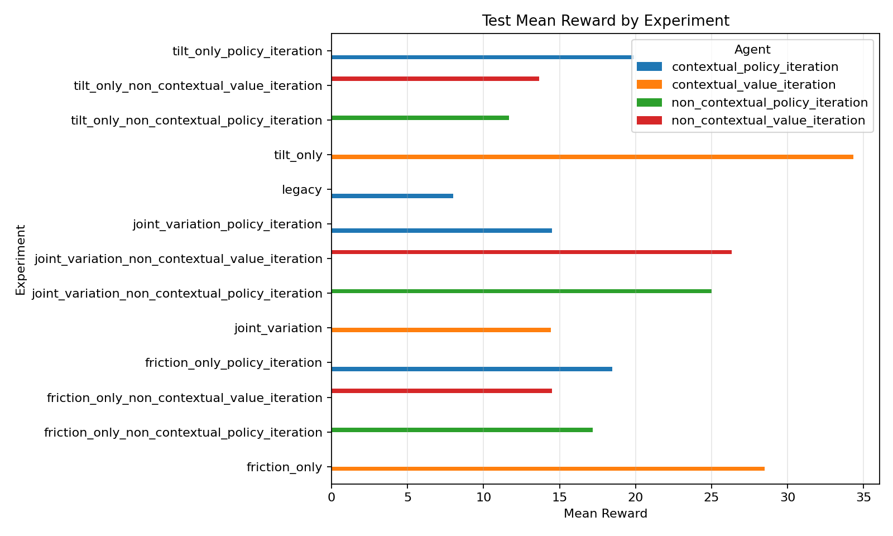
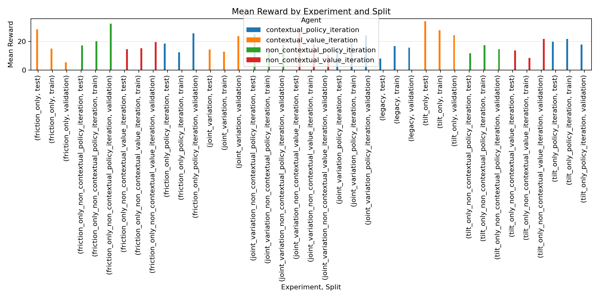
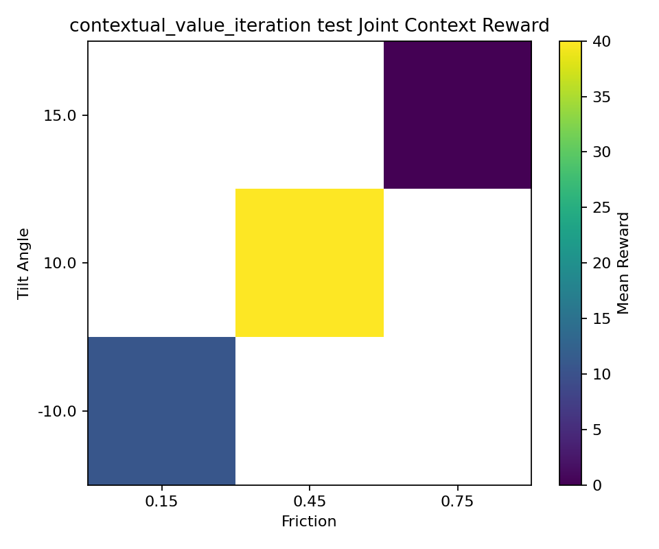
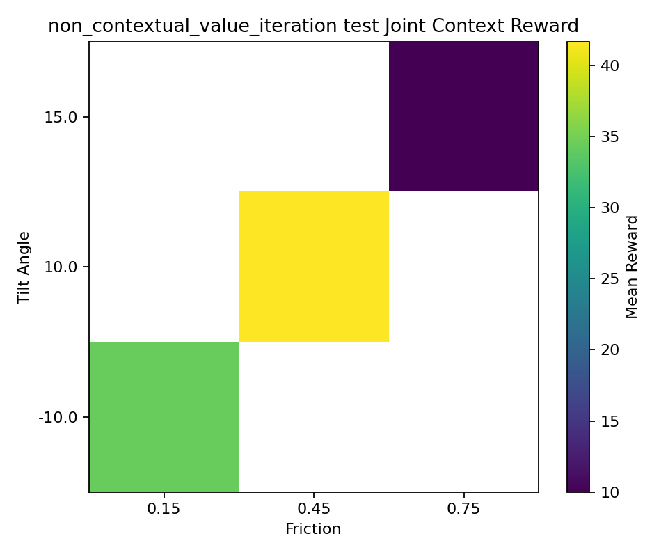
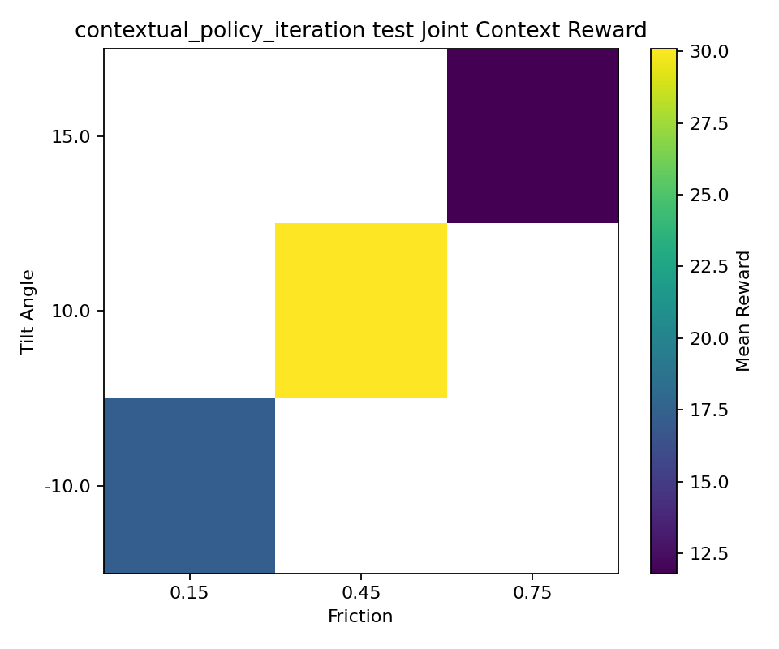
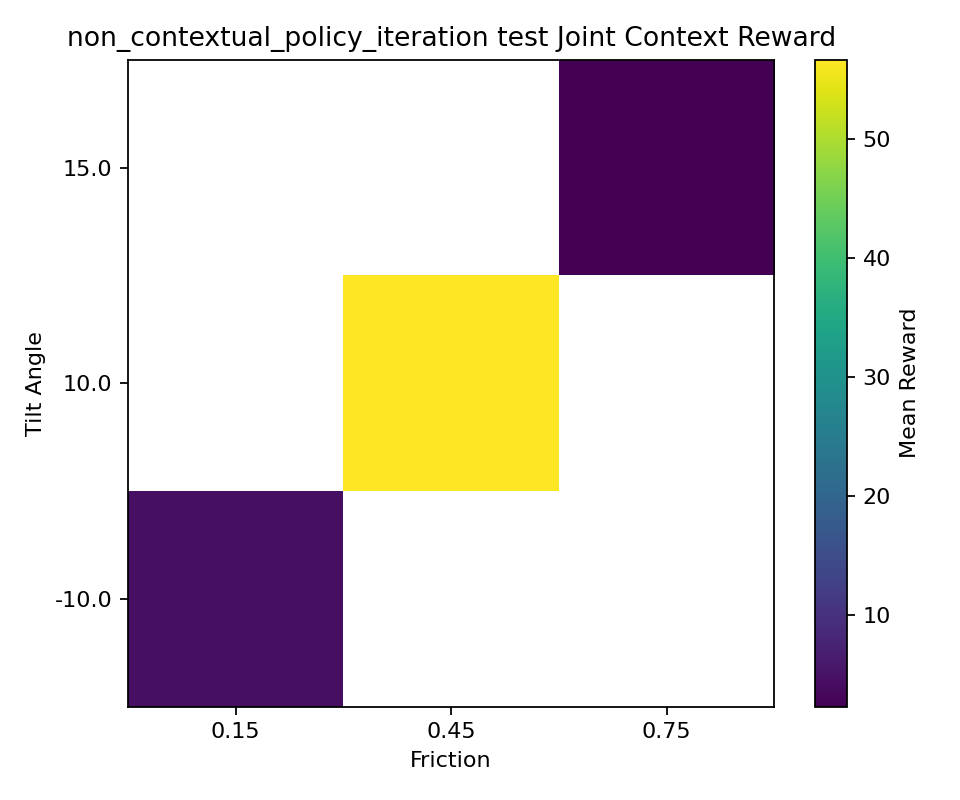

# Week 2 Contextual RL Report

This report summarizes the contextual Mars Rover experiments with:

- contextual value iteration
- contextual policy iteration
- non-contextual value iteration
- non-contextual policy iteration

The experiments were run in three scenario families:

- tilt-only variation
- friction-only variation
- joint tilt-and-friction variation

The aggregated results and plots were generated from:

- [contextual_test_summary.csv](/home/sohan-deshar/codingworkspace/python/uni_RL/RL-exercises/results/contextual_analysis/contextual_test_summary.csv)
- [contextual_summary_by_split.csv](/home/sohan-deshar/codingworkspace/python/uni_RL/RL-exercises/results/contextual_analysis/contextual_summary_by_split.csv)
- [test_mean_reward_by_experiment.png](/home/sohan-deshar/codingworkspace/python/uni_RL/RL-exercises/results/contextual_analysis/test_mean_reward_by_experiment.png)
- [mean_reward_by_experiment_and_split.png](/home/sohan-deshar/codingworkspace/python/uni_RL/RL-exercises/results/contextual_analysis/mean_reward_by_experiment_and_split.png)

## Figures

### Test Mean Reward By Experiment

### Mean Reward By Experiment And Split

### Joint Variation Heatmaps

Contextual value iteration:

Non-contextual value iteration:

Contextual policy iteration:

Non-contextual policy iteration:

## Setup

- Environment: `TiltedMarsRover`
- Context features: `tilt_angle`, `friction`
- Training schedule: round robin over training contexts
- Evaluation protocol:
  - train and validation evaluated during training
  - test evaluated only at the end
- Current caveats:
  - single seed: `seed_0`
  - small evaluation budget per context
  - some experiment variance is still visible in the per-context results

## Test Results

| Scenario | Contextual VI | Non-contextual VI | Contextual PI | Non-contextual PI |
| --- | ---: | ---: | ---: | ---: |
| Tilt-only | 34.33 | 13.67 | 19.90 | 11.67 |
| Friction-only | 28.50 | 14.50 | 18.45 | 17.17 |
| Joint variation | 14.44 | 26.33 | 14.50 | 25.00 |

## Main Observations

### 1. Context helped clearly in the single-factor settings

In both tilt-only and friction-only experiments, the contextual agents outperformed their non-contextual counterparts.

- Tilt-only:
  - contextual value iteration was the strongest overall result at `34.33`
  - contextual policy iteration also beat the non-contextual policy baseline
- Friction-only:
  - contextual value iteration again led with `28.50`
  - contextual policy iteration was only slightly better than the non-contextual policy baseline, but still ahead

This is the cleanest sign that context can help when the source of variation is structured and relatively simple.

### 2. Joint variation was harder, and the non-contextual baselines won here

For joint tilt-and-friction variation, both non-contextual agents beat the contextual ones on the final test split.

- non-contextual value iteration: `26.33`
- non-contextual policy iteration: `25.00`
- contextual value iteration: `14.44`
- contextual policy iteration: `14.50`

That means the contextual setup did not automatically improve generalization once both context factors varied together.

### 3. Value iteration was stronger than policy iteration in the contextual setting

Across the simpler contextual scenarios, contextual value iteration was the best-performing contextual method:

- tilt-only: `34.33` vs contextual PI `19.90`
- friction-only: `28.50` vs contextual PI `18.45`

So in this implementation, contextual value iteration was the more effective contextual planner.

### 4. The joint setting shows strong per-context instability

The per-context breakdown shows that some joint test contexts are handled well while others fail badly.

Examples from the joint test split:

- contextual value iteration:
  - `(-10.0, 0.15) -> 10.67`
  - `(10.0, 0.45) -> 40.00`
  - `(15.0, 0.75) -> 0.00`
- non-contextual value iteration:
  - `(-10.0, 0.15) -> 34.33`
  - `(10.0, 0.45) -> 41.67`
  - `(15.0, 0.75) -> 10.00`

So the poor contextual joint average is not because the agent is uniformly weak. It is because some context combinations are handled very poorly, especially the harder high-friction cases.

## Interpretation

A reasonable interpretation is:

- when only one factor changes, explicit context helps because the mapping from context to transition structure is simple
- when both factors change together, the contextual agents in this small tabular setup may be too brittle, or the chosen train/test split may favor policies that generalize reasonably even without explicit context
- the joint case also seems sensitive to specific held-out contexts, which matters because the final test mean is averaged over only a few of them

Another important point is that the current non-contextual baseline is strong because it still interacts with the same environment family during training; it just does not use context directly in action selection. In this small problem, that may be enough to get robust behavior on some held-out contexts.

## Takeaways

- Context improved results in the tilt-only and friction-only settings.
- Context did not help in the joint variation setting in the current runs.
- Contextual value iteration was the strongest contextual method overall.
- The joint contextual setting needs more investigation before concluding that context is generally beneficial here.

## Next Steps

- rerun all experiments with multiple seeds
- increase `n_eval_episodes` to reduce evaluation noise
- compare averages and standard deviations across seeds
- inspect whether the contextual agents should be retrained or replanned differently in the joint setting
- check whether the train/validation/test context split is too sparse for the contextual joint case
