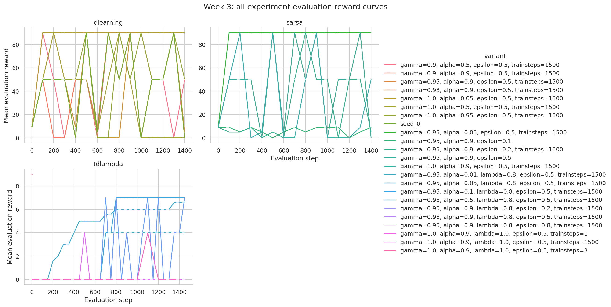
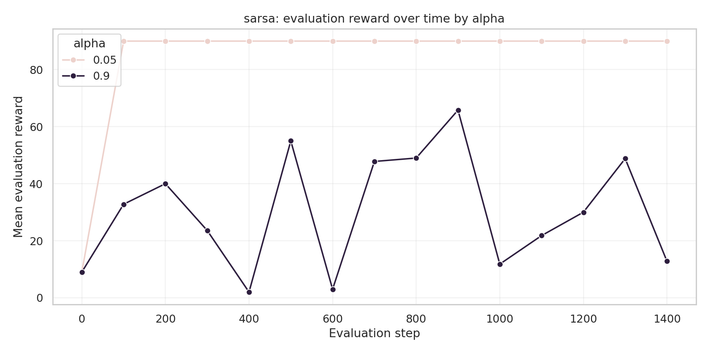
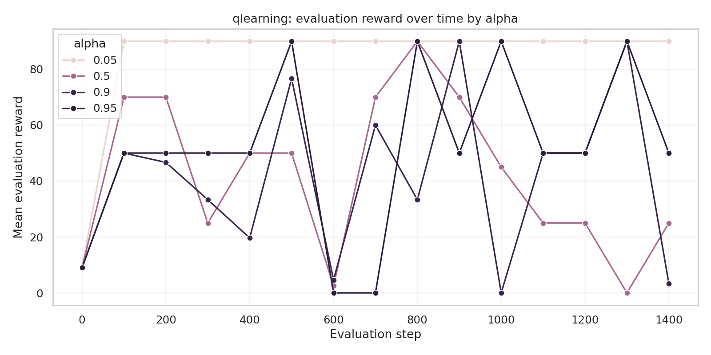
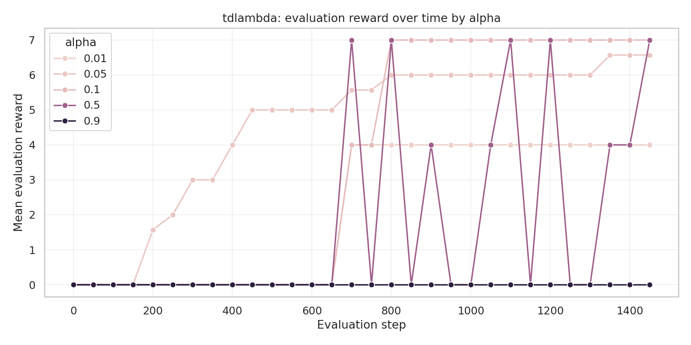

# Week 3 Model-Free Control Report

## Experiment

This report compares the Week 3 model-free control agents on `MarsRover` using the root result files under `results/`. It includes SARSA, Q-learning, and TD(lambda). The plots were generated from `eval_rewards.csv` files using `rl_exercises/plotting/notebook_week3.ipynb`.

The main comparison metric is evaluation reward over training. Most SARSA and Q-learning sweeps have one seed per hyperparameter setting, while TD(lambda) has seven seeds for `alpha = 0.05`. Results with one seed should be interpreted as preliminary.

## SARSA

The strongest SARSA setting in the current runs is `gamma = 0.95`, `alpha = 0.05`, `epsilon = 0.5`, and `training_steps = 1500`. It reaches an evaluation reward of `90.0` by step 100 and stays there through the final logged evaluation at step 1400.

Runs with `alpha = 0.9` are much less stable. Across the available SARSA variants, the grouped final reward for `alpha = 0.9` is `12.8 +/- 21.14`, with individual final rewards ranging from `0.0` to `50.0`. This suggests that the larger learning rate can sometimes learn useful behavior, but it is unreliable under the explored settings.

| Agent | Best supported setting | Final eval reward | Seeds/Runs |
| --- | --- | ---: | ---: |
| SARSA | `gamma=0.95`, `alpha=0.05`, `epsilon=0.5`, `trainsteps=1500` | 90.0 | 1 |
| SARSA | grouped `alpha=0.9` variants | 12.8 +/- 21.14 | 5 runs |

## Q-learning

The best Q-learning run is `gamma = 1.0`, `alpha = 0.05`, `epsilon = 0.5`, and `training_steps = 1500`, which reaches a final evaluation reward of `90.0`. This mirrors the SARSA result: the smaller learning rate is the most successful setting in the current sweep.

The other Q-learning settings are mixed. `alpha = 0.95` finishes at `50.0`, grouped `alpha = 0.5` runs average `25.0`, and grouped `alpha = 0.9` runs average only `3.33`. The curves also show high volatility for larger learning rates, with rewards jumping between near-optimal and near-zero evaluations.

| Agent | Setting | Final eval reward |
| --- | --- | ---: |
| Q-learning | `gamma=1.0`, `alpha=0.05`, `epsilon=0.5`, `trainsteps=1500` | 90.0 |
| Q-learning | grouped `alpha=0.5` variants | 25.0 +/- 35.36 |
| Q-learning | grouped `alpha=0.9` variants | 3.33 +/- 2.89 |
| Q-learning | `gamma=1.0`, `alpha=0.95`, `epsilon=0.5`, `trainsteps=1500` | 50.0 |

## TD(lambda)

For TD(lambda), the most reliable setting in the current sweep is `gamma = 0.95`, `alpha = 0.05`, `lambda = 0.8`, `epsilon = 0.5`, and `training_steps = 1500`, because it has seven seeds. It begins with zero reward, starts improving around evaluation step 200, reaches a mean reward of about `5.0` by step 500, and finishes at `6.57 +/- 1.13` at step 1450.

The single-seed TD(lambda) settings are less reliable but still informative. `alpha = 0.10` and `alpha = 0.50` both reach a final reward of `7.0` in their available runs. `alpha = 0.01` improves more slowly and ends at `4.0`. The high-learning-rate `alpha = 0.90` variants mostly fail, with a grouped final mean of `1.5`.

| Alpha | Eval reward at step 500 | Eval reward at step 1000 | Final eval reward at step 1450 | Seeds/Runs |
| ---: | ---: | ---: | ---: | ---: |
| 0.01 | 0.00 | 4.00 | 4.00 | 1 |
| 0.05 | 5.00 | 6.00 | 6.57 +/- 1.13 | 7 |
| 0.10 | 0.00 | 7.00 | 7.00 | 1 |
| 0.50 | 0.00 | 0.00 | 7.00 | 1 |
| 0.90 | mixed | mixed | 1.50 +/- 3.67 | 6 runs |

## Interpretation

The strongest observed Week 3 results come from SARSA and Q-learning with small learning rates. Both reach the maximum observed evaluation reward of `90.0` in their best runs. TD(lambda) improves under `alpha = 0.05`, but its reward scale in the current runs remains much lower, topping out around `6-7`.

The main pattern across all three agents is learning-rate sensitivity. Smaller `alpha` values are more stable, while larger values often produce unstable curves or complete failure. This is especially clear for Q-learning and SARSA, where high-alpha runs can briefly perform well but do not consistently stay near the best reward.

Because most SARSA and Q-learning settings have only one seed, the safest conclusion is not that one algorithm is definitively superior, but that the current best configurations are:

- SARSA: `gamma=0.95`, `alpha=0.05`, `epsilon=0.5`
- Q-learning: `gamma=1.0`, `alpha=0.05`, `epsilon=0.5`
- TD(lambda): `gamma=0.95`, `alpha=0.05`, `lambda=0.8`, `epsilon=0.5`

## Next Steps

Run additional seeds for the best SARSA and Q-learning settings so they can be compared with TD(lambda) using reliable aggregate metrics. Also rerun TD(lambda) with more seeds for `alpha = 0.10` and `alpha = 0.50`, since their single-seed results are competitive with `alpha = 0.05` but not yet statistically meaningful.
