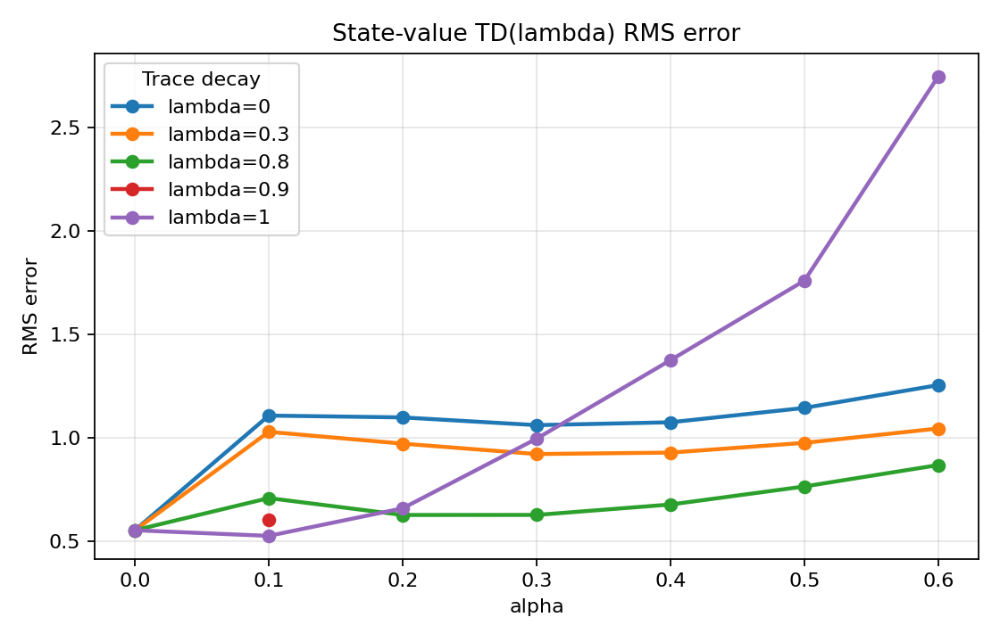

# State-Value TD(lambda) Random Walk Report

## Experiment

This experiment evaluates state-value TD(lambda) on the generated 7-state
MarsRover random-walk dataset. The learned values are compared against the
ideal random-walk state values for the five non-terminal states:

| State | Ideal value |
| ---: | ---: |
| 1 | 0.1667 |
| 2 | 0.3333 |
| 3 | 0.5000 |
| 4 | 0.6667 |
| 5 | 0.8333 |

The reported metric is RMS error over states `1..5`:

```text
sqrt(mean((V(s) - V_ideal(s))^2))
```

The sweep used one seed with `gamma = 1.0`, `epochs = 1`, alpha values from
`0.0` to `0.6`, and lambda values `0.0`, `0.3`, `0.8`, and `1.0`.



## Results

| Lambda | Best alpha | Best RMS error | Pattern |
| ---: | ---: | ---: | --- |
| 0.0 | 0.3 | 1.0612 | High error across all nonzero alpha values. |
| 0.3 | 0.3 | 0.9214 | Better than lambda 0, but still unstable. |
| 0.8 | 0.2 | 0.6266 | Best stable setting among the main sweep. |
| 1.0 | 0.1 | 0.5256 | Lowest RMS error, but degrades quickly as alpha increases. |

The no-learning baseline `alpha = 0.0` has RMS error `0.5528` for every lambda,
because all estimated values remain zero. This baseline is useful: any setting
above `0.5528` is worse than not learning under this evaluation metric.

The strongest observed setting is `lambda = 1.0`, `alpha = 0.1`, with RMS error
`0.5256`. However, this lambda value is very sensitive to alpha. At
`alpha = 0.6`, its RMS error rises to `2.7487`, the worst result in the sweep.

The most robust setting is `lambda = 0.8`. It improves over the no-learning
baseline for `alpha = 0.2` and `alpha = 0.3`, with RMS errors around `0.627`.
Its degradation at higher alpha is much milder than lambda `1.0`.

## Interpretation

Eligibility traces help when paired with a moderate learning rate. Lambda `0.8`
and `1.0` both perform better than lambda `0.0` and `0.3` for small alpha values.
This matches the expected benefit of propagating reward information backward
through a trajectory instead of updating only the current state.

Large alpha values are harmful, especially with long traces. Lambda `1.0`
performs best at `alpha = 0.1`, but becomes unstable as alpha increases. This
suggests that Monte-Carlo-like updates can overshoot badly when the step size is
too large.

Based on this sweep, the safest configuration to continue with is
`alpha = 0.2`, `lambda = 0.8`. The absolute best single run is
`alpha = 0.1`, `lambda = 1.0`, but it appears less robust to alpha choice.

## Limitations

These results use one seed and one generated dataset. The conclusions should be
treated as preliminary. A stronger comparison would average RMS error across
multiple generated random-walk datasets and multiple seeds.
